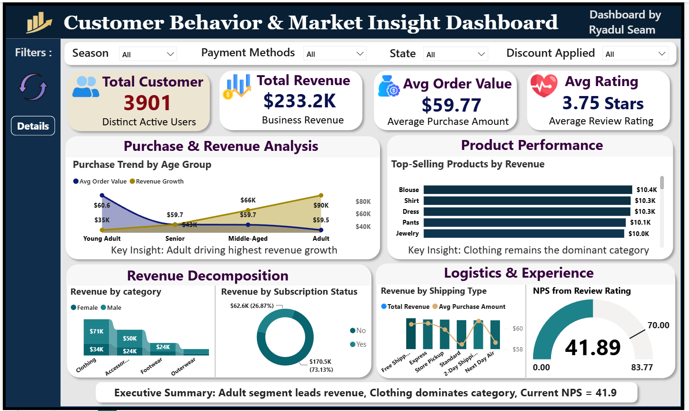
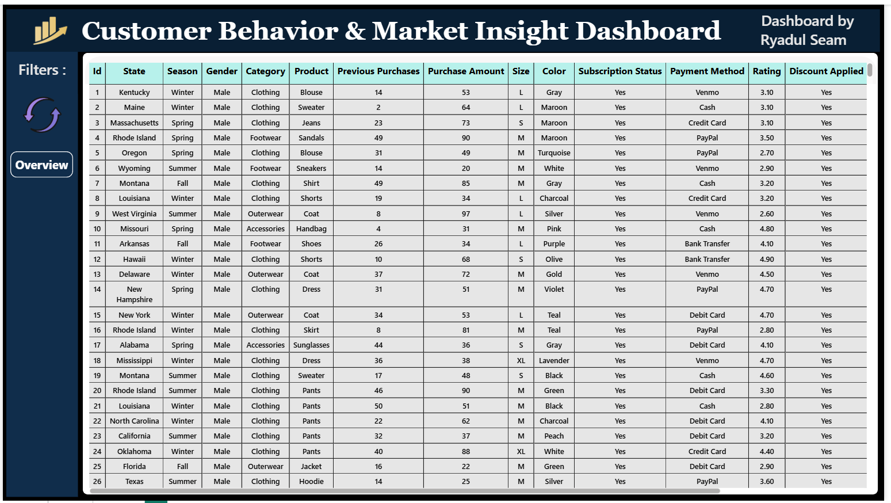

# 🛍️ Customer Behavior & Market Insight Dashboard

**End-to-End Customer Analytics & Predictive Business Intelligence Solution for a Multi-Category Retail Business**


Analyzing **3,901 customers** across demographics, subscriptions, and shipping experience to uncover revenue drivers, loyalty gaps, and growth opportunities using **SQL, Python, and Power BI**.

---

## 📌 Table of Contents

- [Project Overview](#-project-overview)
- [Business Problem](#-business-problem)
- [Dataset](#-dataset)
- [Tech Stack](#-tech-stack)
- [Project Structure](#-project-structure)
- [Pipeline Workflow](#-pipeline-workflow)
- [Data Cleaning & Feature Engineering](#-data-cleaning--feature-engineering)
- [SQL Analysis Highlights](#-sql-analysis-highlights)
- [Power BI Dashboard](#-power-bi-dashboard)
- [Key Insights](#-key-insights)
- [Predictive Modeling](#-predictive-modeling)
- [Getting Started](#-getting-started)
- [Reports](#-reports)
- [Final Recommendations](#-final-recommendations)
- [Author & Contact](#-author--contact)
- [License](#-license)

---

## 📌 Project Overview

A retail business selling across Clothing, Footwear, Accessories, and Outerwear had rich transactional data but no consolidated view of *who* was driving revenue, *why* customers churned or stayed loyal, or *how* shipping experience tied back to satisfaction.

This project builds a full analytics pipeline to answer:

- Which customer segments and product categories generate the most revenue?
- How much of the business depends on subscribers vs. one-off shoppers?
- Which shipping methods correlate with higher satisfaction?
- Can a customer's purchase amount or product category be predicted from their profile?

**Key result:** Identified the **Adult segment ($90K revenue)** as the primary growth engine, found that subscribers drive **73.13% of total revenue ($170.5K)**, and flagged a **28-point NPS gap (41.89 vs. a 70 target)** as the top priority for retention strategy — all surfaced through a single-page executive Power BI dashboard.

---

## 💼 Business Problem

In a competitive retail environment, understanding *why* customers buy — not just *what* they buy — is critical. This project aims to:

- Segment customers by demographics and identify the highest-value groups
- Quantify the revenue contribution of subscribers vs. non-subscribers
- Measure customer satisfaction (NPS, review ratings) against shipping performance
- Predict transaction revenue and product category from customer attributes
- Support data-driven decisions for marketing, retention, and logistics

---

## 🗃️ Dataset

- **Source:** `customer_shopping_behavior.csv`
- **Size:** 3,901 customer records
- **Key Columns:** Customer ID, Age, Gender, Category, Item Purchased, Purchase Amount, Location, Season, Review Rating, Subscription Status, Shipping Type, Discount Applied, Previous Purchases
- **Processed Output:** `predictions.csv` (model predictions vs. actuals)

---

## 🛠️ Tech Stack

| Layer | Tools |
|---|---|
| Database | PostgreSQL |
| ETL & Analysis | Python (pandas, NumPy, SQLAlchemy, psycopg2) |
| Machine Learning | scikit-learn (RandomForest, LinearRegression), XGBoost |
| Visualization (EDA) | matplotlib, seaborn, Jupyter Notebook |
| BI Dashboard | Power BI (Power Query, DAX) |
| Data Modeling | Star-schema-style relationships |
| Others | Git, GitHub |

---

## 🗂️ Project Structure

```bash
customer-behavior-analytics-powerbi/
│
├── README.md
│
├── data/
│   ├── raw/
│   │   └── customer_shopping_behavior.csv    # Original, unprocessed customer data
│   └── prediction_data/
│       └── predictions.csv                   # Model output: actual vs. predicted revenue
│
├── scripts/
│   ├── ETL_Pipeline.py                       # Clean, transform, and load data into PostgreSQL
│   ├── EDA_Analysis.py                       # Exploratory data analysis & missing value handling
│   ├── Feature_Engineering.py                # Derived features (age group, loyalty score, etc.)
│   ├── Predicting_Product_Category.py        # Random Forest classifier for product category
│   └── Predicting_Transaction_Revenue.py     # Regression models for transaction revenue
│
├── notebooks/
│   ├── customer_behaviour_analysis.html
│   └── customer_behaviour_analysis.ipynb
│
├── sql/
│   └── sql_queries.sql                       # Full analytical query set (CTEs, window functions)
│
├── icons/
│   ├── cycle.png
│   ├── gross.png
│   ├── group.png
│   ├── growth_chart.png
│   ├── profit-up.png
│   └── pulse.png
│
├── dax/
│   └── measures.dax                          # Power BI DAX measures (KPIs, NPS, segmentation)
│
├── reports/
│   ├── executive_summary.md                  # Strategic summary & recommendations
│   └── project_presentation.pdf              # Stakeholder-facing slide deck
│
└── dashboard_images/
    ├── overview.png                          # Power BI dashboard - main KPI view
    └── details.png                           # Raw/detail table view
```

---

## 🔄 Pipeline Workflow

```
Raw CSV (3,901 rows)
        │
        ▼
  ETL_Pipeline.py               → cleans, types data, loads to PostgreSQL
        │
        ▼
  EDA_Analysis.py               → missing value analysis, category-level imputation
        │
        ▼
  Feature_Engineering.py        → age_group, purchase_frequency_days, price_category, loyalty_score
        │
        ├──▶ Predicting_Product_Category.py     (Random Forest classification)
        └──▶ Predicting_Transaction_Revenue.py  (Linear Regression / Random Forest / XGBoost)
        │
        ▼
  PostgreSQL                    → sql_queries.sql (segmentation, LTV, churn risk, top products)
        │
        ▼
  Power BI                      → measures.dax + dashboard visuals → Executive Summary
```

---

## 🧹 Data Cleaning & Feature Engineering

- Standardized column names and resolved the `purchase_amount_(usd)` naming inconsistency
- Imputed missing `review_rating` values using category-level medians
- Engineered `age_group` (Young Adult, Adult, Middle-Aged, Senior) via quartile binning
- Mapped `frequency_of_purchases` text values to numeric `purchase_frequency_days`
- Derived `price_category` (Low/Medium/High), `basket_size`, and a composite `loyalty_score`
- Loaded the cleaned dataset into PostgreSQL for SQL-based analysis

---

## 📊 SQL Analysis Highlights

The `sql/sql_queries.sql` file contains 28 modular, business-question-driven queries covering:

- Top-selling categories and revenue by age group / location
- Customer segmentation into **New** (1 purchase), **Returning** (2–10), and **Loyal** (10+) via `CASE` logic
- Subscription status vs. average spend and total revenue
- Shipping type vs. customer satisfaction (review rating)
- Top 3 products per category using `RANK() OVER (PARTITION BY ...)`
- High-value customer identification (top 10% by spend) and discount effectiveness analysis
- Customer lifetime value (LTV) estimation and repeat purchase behavior

---

## 📈 Power BI Dashboard

An interactive two-page dashboard featuring:

- **KPI cards** — Total Customers, Total Revenue, Avg Order Value, Avg Rating
- **Purchase trend by age group** — combo chart tracking Avg Order Value vs. Revenue Growth
- **Top-selling products by revenue** — ranked bar chart
- **Revenue decomposition** — by category/gender and subscription status (donut)
- **Logistics & experience** — revenue by shipping type vs. average purchase amount
- **NPS gauge** — current score against the 70-point industry benchmark
- **Detail table view** — full transaction-level grid with filters (Season, State, Category)
- Dynamic KPI and segmentation measures built entirely in DAX (see `dax/measures.dax`)

| Overview | Detail Table |
|---|---|
|  |  |

---

## 🔍 Key Insights

- **Revenue performance:** Total Revenue = **$233.2K** (+5.4% growth), Total Active Users = **3,901**, Average Order Value = **$59.77**.
- **Demographic driver:** The **Adult** segment leads with **$90K** in revenue and the highest growth rate, followed by Middle-Aged ($66K), Senior ($39K), and Young Adult ($35K).
- **Category dominance:** **Clothing** is the largest revenue category, led by Blouse ($10.4K, +6.7%), Shirt ($10.3K, +5.1%), and Dress ($10.3K, +5.2%).
- **Subscription dependency:** Subscribers generate **73.13% of revenue ($170.5K)** vs. **26.87% ($62.6K)** from non-subscribers — though non-subscribers show a slightly higher average spend per order.
- **Satisfaction gap:** Average Review Rating sits at **3.75 stars**, and NPS is **41.89** — a **28.11-point gap** below the 70-point target benchmark.
- **Seasonal patterns:** Jackets peak in Fall demand; Sweaters lead in Spring, pointing to clear opportunities for seasonal inventory planning.

Full strategic recommendations are available in `reports/executive_summary.md`.

---

## 🤖 Predictive Modeling

| Model | Script | Target | Method |
|---|---|---|---|
| Transaction Revenue | `Predicting_Transaction_Revenue.py` | `purchase_amount` | Linear Regression, Random Forest, XGBoost |
| Product Category | `Predicting_Product_Category.py` | `category` | Random Forest Classifier |

### Regression Model Comparison (RMSE)

| Model Type | RMSE |
| :--- | :--- |
| **Linear Regression** | ~23.5 (best) |
| **XGBoost** | ~26.5 |
| **Random Forest** | ~27.0 |

Linear Regression delivered the most accurate purchase-amount predictions. Both models use `age`, `purchase_frequency_days`, and `review_rating` as core features, with the classification model enabling more personalized, category-level marketing.

---

## ⚙️ Getting Started

### Prerequisites

**Required:**
- Python 3.9+ 
- PostgreSQL 13+ 
- Power BI Desktop (for dashboard) 

**Recommended Tools:**
- VS Code (with Python extension)
- Jupyter Notebook (for exploratory analysis)
- Git & GitHub

### Install Dependencies

```bash
pip install pandas numpy matplotlib seaborn scikit-learn xgboost sqlalchemy psycopg2-binary
```

### Run the Pipeline

```bash
# 1. Clone the repository
git clone https://github.com/RyadulSeam/customer-behavior-analytics-powerbi.git
cd customer-behavior-analytics-powerbi

# 2. Run ETL to clean and load data into PostgreSQL
python scripts/ETL_Pipeline.py

# 3. Explore the data
python scripts/EDA_Analysis.py

# 4. Engineer features for modeling
python scripts/Feature_Engineering.py

# 5. Run predictive models
python scripts/Predicting_Product_Category.py
python scripts/Predicting_Transaction_Revenue.py

# 6. Execute analytical queries
# Run sql/sql_queries.sql against your PostgreSQL instance
```

> **Note:** File paths in the scripts are set to a local environment and the PostgreSQL connection string uses local defaults — update these to match your own environment before running.

### View the Dashboard

Open the Power BI `.pbix` file ( not included in this repo for size reasons, DM me on [linkedin.com/in/ryadulseam-data](https://www.linkedin.com/in/ryadulseam-data) for the live .pbix file ) and connect it to your local PostgreSQL instance, or explore the static exports in `dashboard_images/`.

---

## 📁 Reports

- 📄 **[Executive Summary](reports/executive_summary.md)** — strategic overview and business recommendations
- 📊 **[Project Presentation](reports/project_presentation.pdf)** — stakeholder-facing slide deck
- 🗒️ **[SQL Queries](sql/sql_queries.sql)** — full annotated query set

---

## ✅ Final Recommendations

1. **Close the NPS gap** — launch loyalty and service-recovery initiatives to bridge the 28.11-point deficit against the 70-point benchmark.
2. **Double down on the Adult segment and Clothing category** — the proven primary engines of revenue and growth.
3. **Convert non-subscribers** — design targeted incentives to bring the 26.87% non-subscriber revenue base into the subscription model.
4. **Optimize shipping strategy** — prioritize the shipping profiles most strongly correlated with high satisfaction to lift review ratings.
5. **Plan inventory seasonally** — align Jacket and Sweater stock with their respective Fall/Spring demand peaks.

---

## 👤 Author & Contact

**Ryadul Seam**

**Data Analytics & Power BI Consultant | Founder @ SEAM ANALYTICS**

**I help Finance, Operations, Retail, Logistics, and E-commerce teams turn messy raw data into clear, actionable business insights.**

- 📧 Email: [ryadulisla@gmail.com](mailto:ryadulisla@gmail.com)
- 🔗 LinkedIn: [linkedin.com/in/ryadulseam-data](https://www.linkedin.com/in/ryadulseam-data)
- 🔗 Portfolio: [Ryadul Seam | Data Analyst | Portfolio](https://substantial-vole-da7.notion.site/Ryadul-Seam-Data-Analyst-Portfolio-2d8fd4f37d128056b5aeeee355a325fe)

Feel free to connect or reach out to collaborate on your next analytics project.

---

## 📄 License 

This project is licensed under the **MIT License** — see the [LICENSE](LICENSE) file for details.

---

<p align="center">Built with ❤️ for data-driven retail growth<br>⭐ Star this repo if you found it useful!</p>
